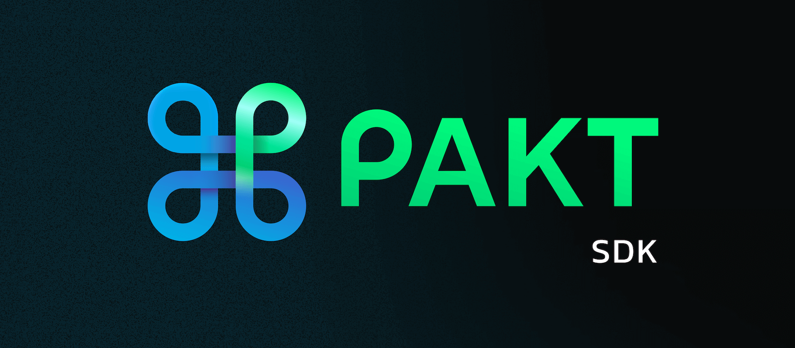

# PAKT

[](https://twitter.com/PaktWorld)

PAKT SDK is a modern software development kit, built for NodeJs.

# Table of Contents

- [Installation](#installation)

- [Initialization](#initialization)

- [Authentication](#authentication)

- [Account](#account)

- [Notification](#notification)

- [Upload](#upload)

- [Review](#review)

- [Wallet](#wallet)

- [Withdrawal](#withdrawal)

- [Collections](#collections)

## Installation

To install PAKT SDK, simply

`npm install pakt-sdk`

`yarn add pakt-sdk`

> :warning: Ensure you are registered on www.pakt.world, with a paid and activated chainsite.

## Initialization

See below code block for initilization

```typescript
//Typescript
import PaktSDK from "pakt-sdk";

const apiKey = config.PAKT_SDK_API_KEY;
const configData: PaktConfig = {
  token: apiKey,
  verbose: true,
};

const sdkInit = await PaktSDK.init(configData);
```

```javascript
//Javascript
const PaktSDK = require("pakt-sdk");

const apiKey = config.PAKT_SDK_API_KEY;
const configData = {
  token: apiKey,
  verbose: true,
};
const sdkInit = await PaktSDK.init(configData);
```

The above code initializes the PAKT SDK, ensure the API KEY is generated on www.pakt.world.

---

To make calls with the PAKT SDK is very easy. See below code blocks for examples. The SDK is also typed with the models and wrapped with a default `ResponseDto<T>`.

`ResponseDto<T>` is declared as

```typescript
interface ResponseDto<T> {
  data: T;
  status: Status;
  message?: string;
  code?: string;
}

//For example, from the initialized sdk, we can login like so:

const auth: ResponseDto<UserModelDto> = await sdkInit.auth.login();
```

For brevity, the examples below will include the encapsulating `T`.

## Authentication

With the PAKT SDK, users can:

- Register on the Chainsite,
- Login,
- Verify Account,
- Resend Verification Link,
- Reset Password,
- Change Password,
- Validate Reset Password,

### Registration

Here's how to register via the PAKT SDK

```typescript
export const signUp = async ({
  firstName,
  lastName,
  email,
  password,
}: {
  firstName: string;
  lastName: string;
  email: string;
  password: string;
}) => {
  const payload: RegisterPaylod = {
    firstName: string,
    lastName: string,
    email: string,
    password: string,
  };

  type RegisterDto = {
    tempToken: {
      token: string;
      token_type: string;
      expiresIn: number;
    };
  };
  const register: RegisterDto = await sdkInit.auth.register(firstName, lastName, email, password);
};
```

### Login

With the PAKT SDK, users can login to their account, see example below:

```typescript
export const login = async (email: string, password: string) => {
  type LoginDto = {
    email: string;
    token: string;
    onboarded: boolean;
    isVerified: boolean;
    tempToken: {
      token: string;
      expiresIn: number;
    };
  };
  const login: LoginDto = await sdkInit.auth.login(email, password);
};
```

### VerifyAccount

Every registered email needs to be verified, hence, PAKT SDK allows for verifying the account. The temporary authorization token and the OTP (token) sent to the email is entered to complete verification.

See example below:

```typescript
export const verifyAccount = async (tempToken: string, token: string) => {
  type AccountVerifyDto = {
    email: string;
    token: string;
    expiresIn: number;
  };

  const verify: AccountVerifyDto = await sdkInit.auth.verifyAccount(tempToken, token);
};
```

### Resend Verification Link

In the event, a user needs a new verification OTP (token), this function is used to resend the verification

```typescript
export const resendVerification = async (email: string) => {
  type ResetDto = {
    tempToken: {
      token: string;
      expiresIn: number;
    };
  };
  const resent: ResetDto = await sdkInit.auth.resendVerifyLink(email);
};
```

### Reset Password

Users can reset password in the case the password cannot be recollected. A temporary authorization is returned as the response, see `ResetDto`.
An example below:

```typescript
export const resetPassword = async (email: string) => {
  const reset: ResetDto = await sdkInit.auth.resetPassword(email);
};
```

## Account

With the Pakt SDK, users can:

- Get User Information
- Onboard a User
- Update Account for a user
- Change Password
- Setup Two-factor Authentication
- Activate/Deactivate Two-factor Authentication

### Update User Info

```typescript
//From the initialised sdkInit,

//Setup user information Model

interface UserAccountDto {
  _id: string;
  type: string;
  email: string;
  lastName: string;
  firstName: string;
  paktScore: number;
  profileCompleteness: number;
  profileImage?: {
    url: string;
  };
  ...
}
export const updateUserInfo = async ({payload}:{payload: {userName: string;profileImage: string; socials: {github: string; twitter: string; linkedin: string; website: string;} }}) => {
  const latestUserInfo: UserAccountDto = await sdkInit.account.updateAccount(payload);
};
```

The example above updates a user account, setup the payload with the latest information about the user, which includes, but not limited to the userName, profileImage, social media links etc.

---

### Change Password

With the Pakt SDK, users can change their password, see example below:

```typescript
export const changeUserPassword = async (oldPassword: string, newPassword: string) => {
  const payload: ChangePasswordPayload = {
    oldPassword: oldPassword,
    newPassword: newPassword,
  };
  const userInfo: UserAccountDto = await sdkInit.account.changePassword(payload);
};
```

---

### Two Factor Authentication

To improve user securing their accounts better, the PAKT SDK offers the two-factor authentication. Users can initiate, activate and deactivate the two-factor auth.

See examples below:

### Initiate two-factor authentication

This begins the process of the two-factor auth setup.

```typescript
type TwoFaType = "google_auth" | "email";
export const initiateTwoFa = async (type: TwoFaType) => {
  interface TwoFaResponse {
    type: TwoFaType;
    qrCodeUrl?: string;
    tempToken?: {
      token: string;
      expiresIn: number;
    };
  }

  const twoFaInit: TwoFaResponse = await sdkInit.account.initate2FA(type);
};
```

---

### Activate Two-factor authentication

To activate the two-factor auth, see example:

```typescript
export const activateTwoFa = async (code: string) => {
  await sdkInit.account.active2FA(code);
};
```

### Deactivate Two-factor authentication

To deactivate the two-factor auth, see example:

```typescript
export const activateTwoFa = async (code: string) => {
  await sdkInit.account.deactive2FA(code);
};
```

---

## Notification

With the PAKT SDK, users can:

- Mark all their notifications as read
- Mark a notification as read
- Get all notifications

Notification Model is as below

```typescript
interface NotificationModel {
  owner: NotificationUser;
  title: string;
  description: string;
  read: boolean;
  notifyUser: NotificationUser;
  data: string;
  isAdmin: boolean;
  type: INotificationType;
}
```

### Mark all Notifications as read

```typescript
export const markAll = async () => {
  //it returns a void
  await sdkInit.notifications.markAll();
};
```

### Mark a notification as read

```typescript
export const markSingleAsRead = (notificationId: string, filter?: NotificationModel) => {
  //it returns a void
  await sdkInit.notifications.markOneAsRead();
};
```

### Get All Notifications

```typescript
type FilterDto = {
  page?: string;
  limit?: string;
} & INotificationDto;

type FindNotificationDto = {
  page: number;
  pages: number;
  total: number;
  limit: number;
  notification: INotificationDto[];
};

export const getAll = async (filter?: FilterDto) => {
  const notifications: FindNotificationDto = await sdkInit.notifications.getAll(filter);
};
```

## Upload

With the PAKT SDK, users can:

- Upload a file, Users can upload the following file extensions
- Video files with extensions, .mp4, .mkv
- Music files with extension, .mp3, .wma, .oog, .mpeg
- Image files with extension, .png, .jpg, jpeg, .svg
- Document files with extension, .pdf, .doc, .docx, .xls, xlsx, .ppt, .csv.

### Upload a File

```typescript
interface IUploadDto {
  name: string;
  uploaded_by: UploadedUser;
  url: string;
  meta: Record<string, any> | undefined;
  status: boolean;
  deletedAt: Date;
}

export const upload = async (file: Object) => {
  const upload: IUploadDto = await sdkInit.file.fileUpload({
    file: Object,
  });
};
```

---

## Review

Users can leave a review via the PAKT SDK.

### Leave Review

```typescript
export const addReview = async () => {
  interface AddReviewDto {
    collectionId: string;
    rating: number;
    review: string;
  }

  //returns void
  await sdkInit.review.addReview(payload);
};
```

---

## Wallet

PAKT SDK allows the user to get the following:

- Details of all the wallets,
- Details of a single wallet,
- Get Transactions records executed,
- Get A Transaction details,
- Get Exchange rate for crypto currencies in use,

Models for Wallet & Transaction are typed like so:

```typescript
//Wallet Model
interface IWalletDto {
  owner: UserAccountDto;
  amount: number;
  lock: number;
  usdValue: number;
  usdRate: number;
  spendable: number;
  address: string;
  coin: string;
  walletId: string;
  walletData: string;
  status: IWalletStatus;
  prod: boolean;
  isSystem: boolean;
}

enum ITransactionStatus {
  PENDING = "pending",
  PROCESSING = "processing",
  COMPLETED = "completed",
  FAILED = "failed",
}

enum ITransactionMethod {
  SENT = "sent",
  DEPOSIT = "deposit",
  WITHDRAWAL = "withdrawal",
  RECIEVED = "recieved",
  ESCROW = "escrow",
  JOBPAYOUT = "job-payout",
  FEEPAYOUT = "fee-payout",
}

//Transaction Model
interface ITransactionDto {
  owner: UserAccountDto;
  amount: number;
  sender: string;
  reciever: string;
  currency: string;
  usdValue: number;
  description: string;
  tx: string;
  type: string;
  hash: string;
  method: ITransactionMethod;
  status: ITransactionStatus;
}
```

### Get all Wallets

```typescript
export const getAllWallets = async () => {
  const wallets: IWalletDto[] = await sdkInit.wallet.getWallets();
};
```

### Get Single Wallet Details

Get a single Wallet details

```typescript
export const getSingleWallet = async (coin: string) => {
  const wallet: IWalletDto = await sdkInit.wallet.getSingleWallet(coin);
};
```

### Get a Transaction Details

Returns the details of a transaction of a user

```typescript
export const getATransactionDetails = async (transactionId: string) => {
  const transaction: ITransactionDto = await sdkInit.wallet.getATransaction(transactionId);
};
```

### Get Exchange Rate

Get the exchange rate of Avalanche `$AVAX`, the prevailing cryptocurrency & platform used.

```typescript
export const exchangeRate = async () => {
  interface IWalletExchangeDto {
    avax: number;
  }
  const rate: IWalletExchangeDto = await sdkInit.wallet.getExchange();
};
```

---

## Withdrawal

With the PAKT SDK, users can make withdrawals, as well as fetch list withdrawals history

- Make withdrawal
- Fetch withdrawal history

### Create Withdrawal

Execute a withdrawal

```typescript
interface CreateWithdrawal {
  coin: string;
  amount: number;
  password: string;
  address: string;
}

interface IWithdrawalDto {
  owner: string | IUser;
  txId: string | ITransactionDto;
  chainTxId: string;
  coin: string;
  address: string;
  amount: number;
  usdValue: number;
  usdRate: number;
  status: string;
}
export const create = async ({ payload }: { payload: CreateWithdrawal }) => {
  const withdrawal: IWithdrawalDto = await sdkInit.withdraw.createWithdrawal(payload);
};
```

### Fetch Withdrawals

Fetch withdrawals for a user

```typescript
interface FilterWithdrawalDto {
  page: number;
  limit: number;
  owner: string;
}

interface FindWithdrawalsDto {
  page: number;
  pages: number;
  total: number;
  data: IWithdrawalDto[];
}

export const fetch = async ({ filter }: { filter: FilterWithdrawalDto }) => {
  const withdrawals: FindWithdrawalsDto = await sdkInit.withdraw.fetchWithdrawal(filter);
};
```

## Collections

With the PAKT SDK, users can

- Create collection,
- Get all collection,
- Get a collection by the id,
- Get Saved collection,
- Get Suggested collection,
- Get Invites,
- Get Related collection,
- Cancel collection,
- Complete Deliverable for a collection

### Create Collections

```typescript
interface ICollectionDto {
  _id?: string;
  creator: IUser;
  owner?: IUser;
  owners?: IUser[];
  name: string;
  description: string;
  type: string;
  build?: string;
  category?: string;
  parent?: ICollectionDto | string;
  collections?: ICollectionDto[] | string[];
  stage?: number;
  image?: IUploadDto;
  invite?: string;
  invites?: string[];
  applications?: string[];
  wallet?: string;
  tagsData?: string[];
  tags?: string[];
  attachments?: IAttachmentDto[];
  attachmentData?: string[];
  status?: string;
  inviteAccepted?: boolean;
  isPrivate?: boolean;
  paymentAddress?: string;
  feePayoutResponse?: string;
  rating?: string;
  recipientRating?: string;
  score?: number;
  progress?: number;
  isDeleted?: boolean;
  charges?: string;
  expectedAmount?: string;
  usdExpectedAmount?: string;
  usdExpectedFee?: string;
  rate?: string;
  cancellationReason?: string;
  completed?: boolean;
}

type CreateCollectionDto = {
  type: string;
  name: string;
  category?: string;
  description: string;
  isPrivate: boolean;
  tags?: string[];
  attachments?: string[];
};

export const createCollection = async (payload: CreateCollectionDto) => {
  const create: ICollectionDto = await sdkInit.collection.create(payload);
};
```

### Create Many Collections

```typescript
type CreateManyCollectionDto = {
  type: string;
  parent: string;
  collections: {
    name: string;
    description: string;
    isPrivate: boolean;
    category?: string;
    tags?: string[];
    attachments?: string[];
  }[];
};
export const createManyCollection = async (payload: CreateManyCollectionDto) => {
  const create: ICollectionDto = await sdkInit.collection.createMany(payload);
};
```

### Get all Collections

Get all Collections corresponding to an optional filter, else return ALL collection

```typescript
type filterDto =
  | ({
      page?: string;
      limit?: string;
    } & ICollectionDto)
  | any;

type FindCollectionDto = {
  page: number;
  pages: number;
  total: number;
  limit: number;
  data: ICollectionDto[];
};

export const getAllCollections = async (filter?: filterDto) => {
  const collections: FindCollectionDto = await sdkInit.collections.getAll(filter);
};
```

### Get a collection by id

Get a collection by id

```typescript
export const getACollection = async (id: string) => {
  const collections: ICollectionDto = await sdkInit.collections.getById(id);
};
```

### Get COllections by types

Get Collections by types

```typescript
export const getACollection = async (filter: filterDto) => {
  const collections: FindCollectionDto = await sdkInit.collections.getTypes(filter);
};
```

### Get Details of a collection

```typescript
export const getASingleCollection = async (id: string, filter?: filterDto) => {
  const collection: ICollectionDto = await sdkInit.collection.getById(id, filter);
};
```
